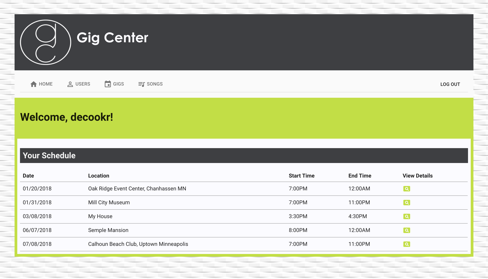
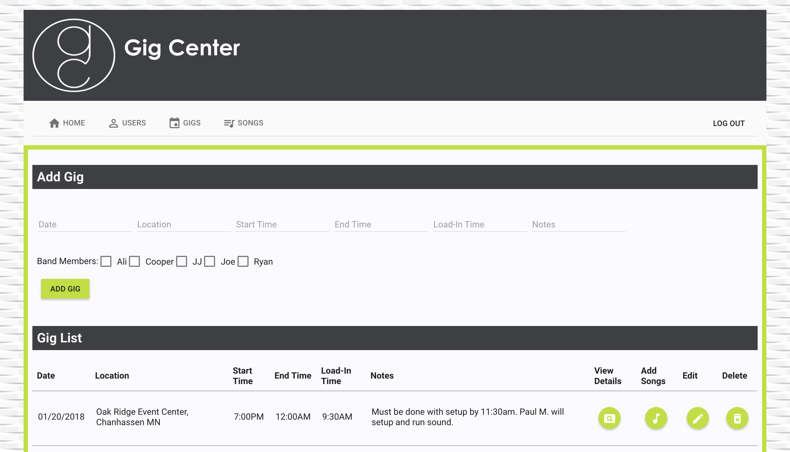
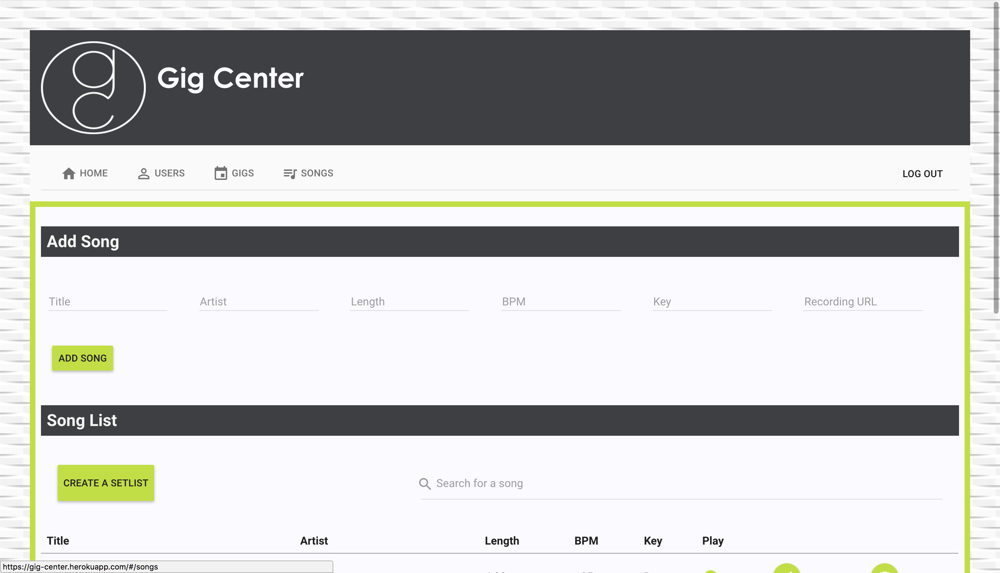

# Gig Center

A full stack web application to help bands and musicians manage details for upcoming gigs. Solves the problem of having to sort through and locate pieces of information in multiple locations (long email chains, text messages, etc.). Users can log into the app and immediately see the events they’ve been scheduled for. They can select a specific gig to view the details. Gigs can also be added and specific band members can be scheduled for that gig. Song lists can also be added to a gig from a database of songs. 

See a live version of the app at https://gig-center.herokuapp.com/#/home 

## Built With

PostgreSQL, Express.js, AngularJS, Node.js, and AngularJS Material

# Getting Started
These instructions will get you a copy of the project up and running on your local machine for development and testing purposes. See deployment for notes on how to deploy the project on a live system.

# Prerequisites
- Node.js
- npm
- PostgreSQL
- homebrew

# Installing
Steps to get the development environment running.

1. npm install
2. Create SQL database gig_center
3. Execute SQL query in database.sql to create database structure.
4. npm start

## Screen Shots

Schedule View

Gig View

Song View

## Author
* Ryan DeCook

